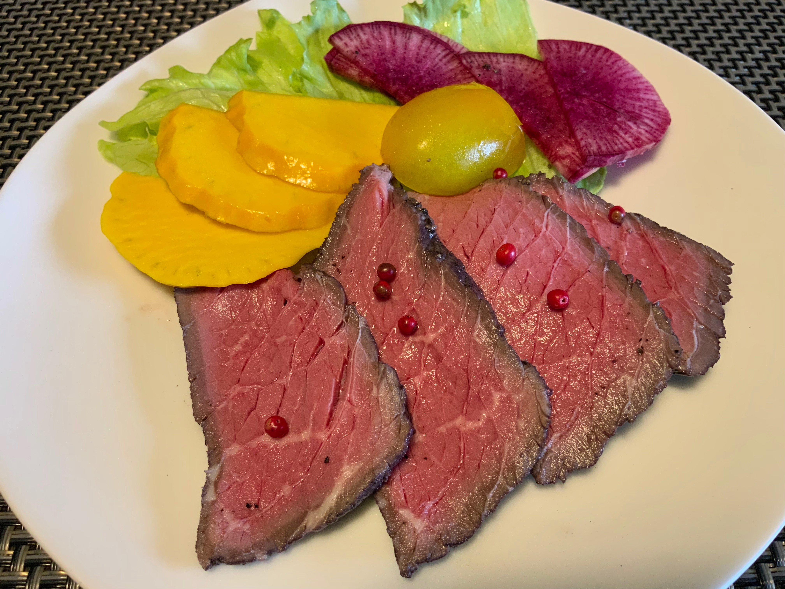
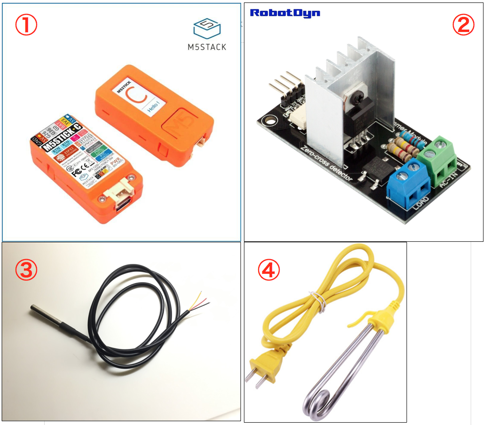
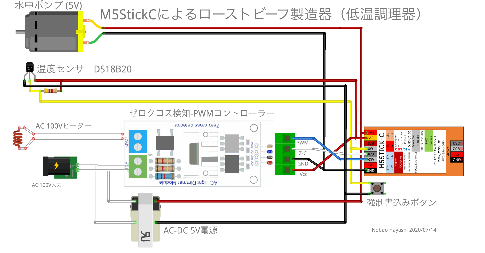
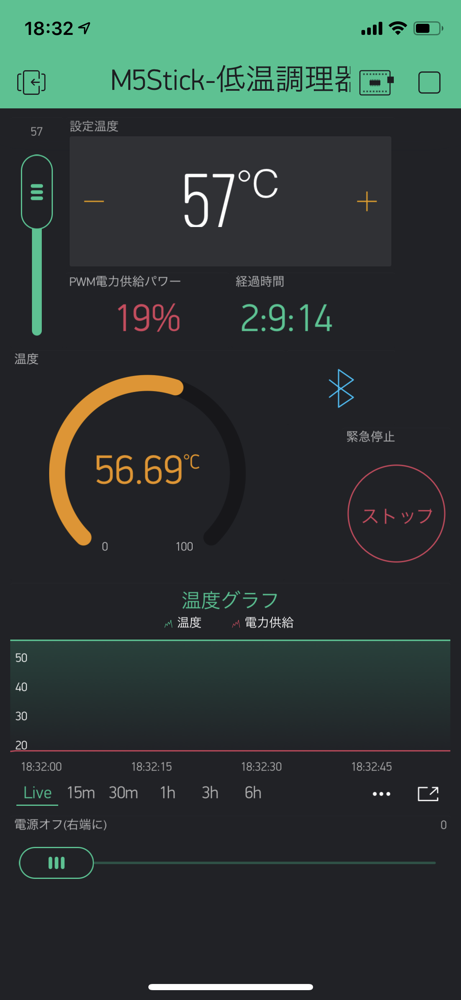

Roast Beaf slow Coocker RobotDyn_M5StickC
=
M5StickC,RobotDyn,DS18B20を使った低温調理器

M5StickCで**57℃の一定の温度**を作り出し、**柔らかくうま味のあるローストビーフを作る**
システム。  
  

構成部品  
-------
主要部品

1.M5StickC  
2.AC電力コントローラー：RobotDyne Zero-Cross Ditect PWM AC Power Controller  
    Zero-Cross_Detect_AC Light Dimmer Module for PWM control：$3.49  
    https://robotdyn.com/ac-light-dimmer-module-1-channel-3-3v-5v-logic-ac-50-60hz-220v-110v.html  
3.温度センサー：DS18B20  
4.カップヒーター  
・攪拌用水中ポンプ  
・AC100V-5V電源  

### 実体配線図  

  

### 出力波形  
電力コントロール50％の時の出力波形  

使い方
------
### スマホからのコントロール ###
コントロール画面の設計はblynkを活用  
デフォルトで57℃に設定している  
変更したい場合は左のスライダーか、「設定温度パネル」の中にある＋ーボタンで任意に変更  
異常動作などの場合は「緊急停止-ストップ」  
電源オフは最下部のスライダーを右いっぱいに引く  

## License
----------
Copyright &copy; 2020 Nobuo Hayashi
Distributed under the [MIT License][mit].
 
[MIT]: http://www.opensource.org/licenses/mit-license.php
