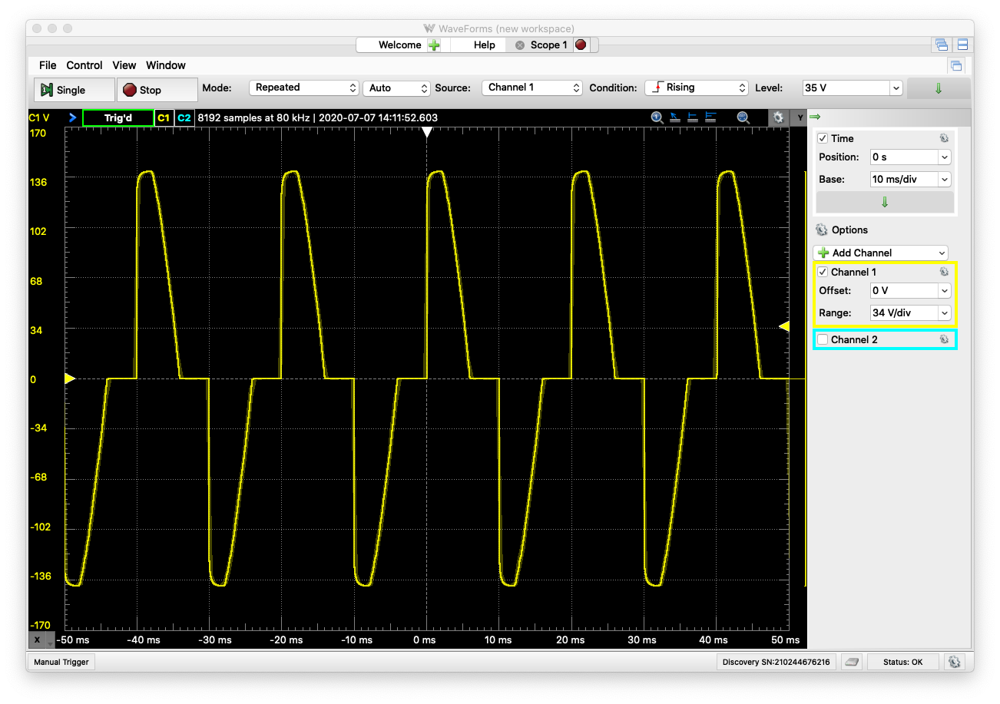

Roast Beaf slow Coocker RobotDyn_M5StickC
=
M5StickC,RobotDyn,DS18B20を使った低温調理器

M5StickCで*57℃の一定の温度*を作り出し、###柔らかくうま味のあるローストビーフを作る###システム。  

構成要素  
-------
・温度センサー：DS18B20  
・AC電力コントローラー：RobotDyne Zero-Cross Ditect PWM AC Power Controller  
・攪拌用水中ポンプ  
・カップヒーター  
・AC100V-5V電源  

### 配線図  

1.   
2.   

使い方
------
### スマホからのコントロール ###
    img/ble_control.png

## License
----------
Copyright &copy; 2020 Nobuo Hayashi
Distributed under the [MIT License][mit].
 
[MIT]: http://www.opensource.org/licenses/mit-license.php
